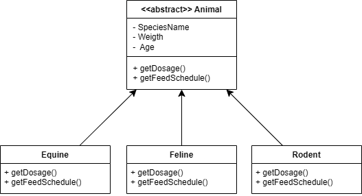

## 1.Ana Sınıf (Base Class):
`Animal` (Soyut Sınıf - Abstract Class)
 - ### Nitelikler (Attributes):
    - `string SpeciesName`(Tür Adı)
    - `double Weigth`(Ağırlık)
    - `int Age`(Yaş)
 - ### Metotlar (Methods):
    - `abstract string getDosage()`(İlaç Dozu Hesaplama - Soyut)
    - `abstract string getFeedSchedule()`(Yem Verme Zamanı - Soyut)
## 2.Alt Sınıflar (Subclasses):
### 2.1.`Equine`(Atlar grubu)
 - ### Metotlar:
    - `override string getDosage()`
       -> Atlar için uygun ilaç dozajını hesaplar.
    - `override string getFeedSchedule()`
       -> Atlar için özel yem verme algoritmasını uygular.
### 2.2.`Feline`(Kedigiller grubu)
  - ### Metotlar:
    - `override string getDosage()`
       -> Kedigiller için uygun ilaç dozajını hesaplar.
    - `override string getFeedSchedule()`
       -> Kedigiller için özel yem verme algoritmasını uygular.
### 2.3.`Rodent`(Kemirgenler grubu)
  - ### Metotlar:
    - `override string getDosage()`
       -> Kemirgenler için uygun ilaç dozajını hesaplar.
    - `override string getFeedSchedule()`
       -> Kemirgenler için özel yem verme algoritmasını uygular.
## 3.Diyagramın Temsili:

