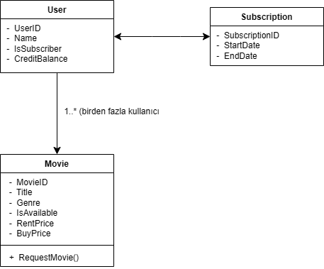

## 1.Sınıflar ve Özellikleri
### 1.1.User (Kullanıcı)
  - ### *Nitelikler*:
      - `string UserID` (Kullanıcı kimliği)
      - `string Name` (Kullanıcı adı)
      - `bool IsSubscriber` (Abonelik durumu)
      - `double CreditBalance` (Kredi bakiyesi)
  - ### *Metotlar*:
      - `void PurchaseCredit(double amount)` (Kredi satın alma)
      - `void RentMovie(Movie movie)` (Film kiralama)
      - `void BuyMovie(Movie movie)` (Film satın alma)
### 1.2.Movie (Film)
  - ### *Nitelikler*:
      - `string MovieID` (Film kimliği)
      - `string Title` (Film adı)
      - `string Genre` (Tür)
      - `bool IsAvailable` (Film mevcut mu?)
      - `double RentPrice` (Kiralama ücreti)
      - `double BuyPrice`(Satın alma ücreti)
  - ### *Metotlar*:
      - `void RequestMovie()` (Film talep etme)
### 1.3.Subscription (Abonelik)
  - ### *Nitelikler*:
      - `string SubscriptionID` (Abonelik kimliği)
      - `User User` (Abonelik sahibi kullanıcı)
      - `DateTime StartDate` (Başlangıç tarihi)
      - `DateTime EndDate` (Bitiş tarihi)
 
## 2.İlişkiler
  ### 1.*User*<->*Subscription*
      - Her kullanıcı sadece bir abonelik sahibi olabilir.
  ### 2.*User*<->*Movie*
      - Kullanıcılar filmleri kiralayabilir veya satın alabilir.
  ### 3.*Movie*
      - Filmleri mevcut olabilir veya talep edilebilir.

## 3.Diyagram Temsili

